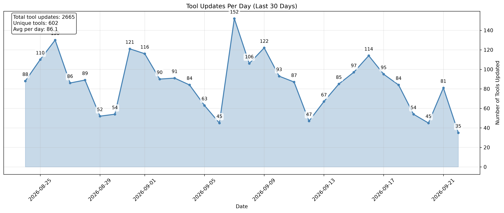

# mise-versions

stores version numbers of common mise plugins

## Tool Update Analysis

This repository tracks tool updates through git history analysis. The chart below shows the daily number of tool updates over the last 30 days.

### Daily Tool Updates (Last 30 Days)



_Timeline showing the number of tools updated each day over the last 30 days_

## Token pool observability

The authenticated `/admin` dashboard records GitHub core-rate-limit snapshots
every 15 minutes. It shows aggregate quota headroom, quota burn per hour, token
checkout rate, estimated time until the 1,000-request-per-token reserve, and
the latest headroom for each pool token.

The monitor warns when only one token is available, a token cannot be checked,
a token falls below reserve, less than 35% of aggregate quota remains, or the
pool is within six hours of reserve. It becomes critical at zero available
tokens, 15% aggregate quota, or two hours to reserve.

Alerts use Resend. `TOKEN_ALERT_TO` and `TOKEN_ALERT_FROM` are non-secret Worker
variables in `wrangler.jsonc`; configure `RESEND_API_KEY` as a Worker secret:

```sh
aube exec wrangler secret put RESEND_API_KEY
```

Alerts are sent on warning/critical transitions, repeated after 12 hours while
unhealthy, and followed by a recovery notification. The deploy workflow syncs
the existing GitHub Actions `RESEND_API_KEY` secret into the Worker.
